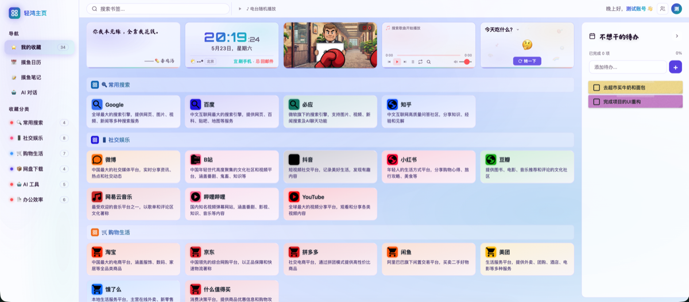
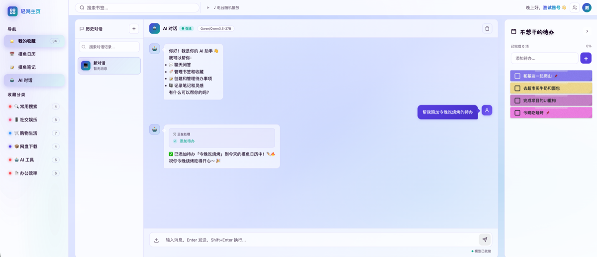
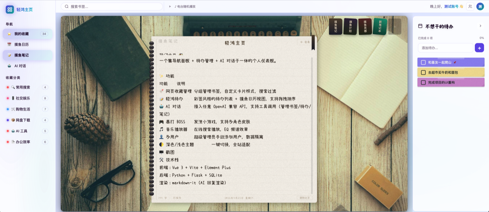
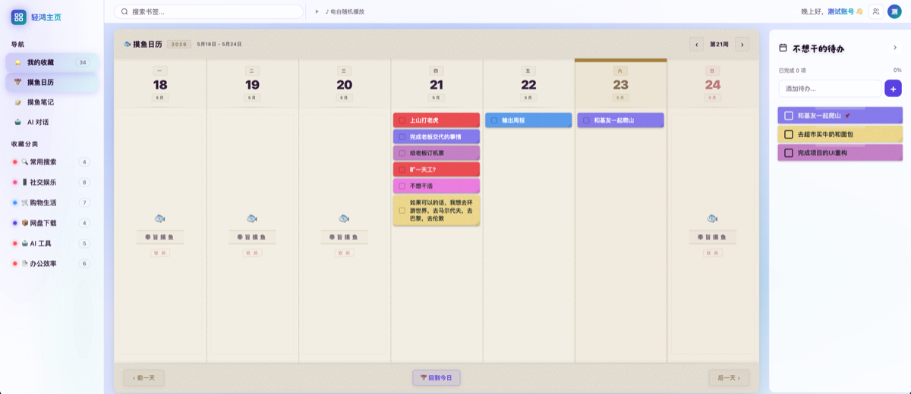

# 轻鸿主页 🏠

  

一个集**导航面板** + **待办管理** + **AI 对话**于一体的个人仪表板。

## ✨ 功能

| 功能 | 说明 |
|------|------|
| 🔖 网页收藏管理 | 分组管理书签，自定义卡片样式，搜索过滤 |
| 📝 轻鸿待办 | 彩签风格的待办列表 + 摸鱼日历视图，支持拖拽排序 |
| 🤖 AI 对话 | 接入任意 OpenAI 兼容 API，支持工具调用（管理书签/待办/笔记） |
| 🎮 暴打 BOSS | 发泄小游戏，支持多角色皮肤 |
| 🎵 音乐播放器 | 在线搜索播放，EQ 频谱效果 |
| 👤 多用户 | 超级管理员手动添加用户，数据隔离 |
| 🌓 深色/浅色主题 | 一键切换，全站适配 |

## 🖥️ 截图

<p align="center">
  
  
</p>
<p align="center">
  
  
</p>

## 🛠️ 技术栈

- **前端**：Vue 3 + Vite + Element Plus
- **后端**：Python + Flask + SQLite
- **渲染**：markdown-it（AI 回复渲染）

## 🚀 快速开始

### 使用 Docker 部署（推荐）

```bash
# 1. 克隆仓库
git clone https://github.com/yourname/qinghong-home
cd qinghong-home

# 2. 复制环境变量
cp .env.example .env
# 修改 .env 中的 SECRET_KEY

# 3. 启动
docker compose up -d
```

### 手动部署

```bash
# 后端
cd backend
python3 -m venv venv
source venv/bin/activate
pip install -r requirements.txt
python3 app.py

# 前端（开发模式）
npm install
npm run dev
```

## ⚙️ 配置 AI 对话

1. 登录后点击右上角 ⚙️ 设置
2. 进入 **AI 设置** 标签
3. 填写 API 地址、API Key、模型名称
4. 支持任何 OpenAI 兼容接口（DeepSeek、通义千问、GLM 等）

## 📁 项目结构

```
轻鸿主页/
├── src/                 # 前端源码 (Vue 3)
├── public/              # 静态资源
│   ├── images/
│   │   ├── game/        # 游戏素材
│   │   ├── backgrounds/ # 背景图片
│   │   └── textures/    # 纹理素材
│   │   ├── wechat.png   # 赞助收款码
│   │   └── alipay.jpg
│   ├── audio/sfx/       # 音效
│   ├── fonts/           # 字体
│   ├── characters/      # 游戏角色
│   └── favicon.svg
├── backend/             # 后端 (Flask)
├── docs/                # 文档
├── docker-compose.yml
├── Dockerfile
└── package.json
```

## ☕ 赞助

如果这个项目对你有帮助，可以请开发者喝一杯咖啡 ❤️

<p align="center">
  
  
</p>

## 📄 许可

MIT
