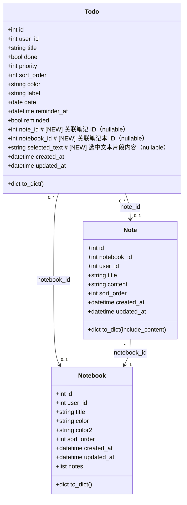
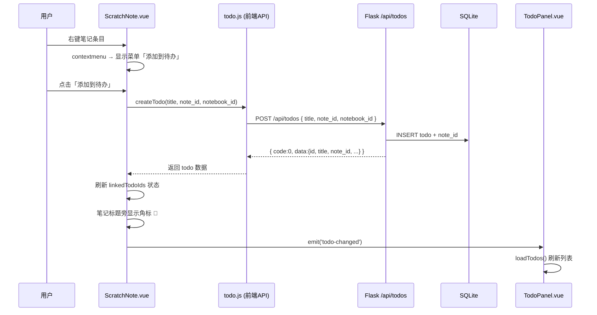
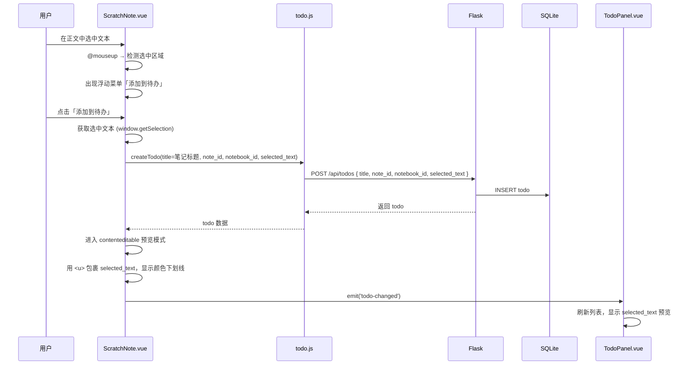
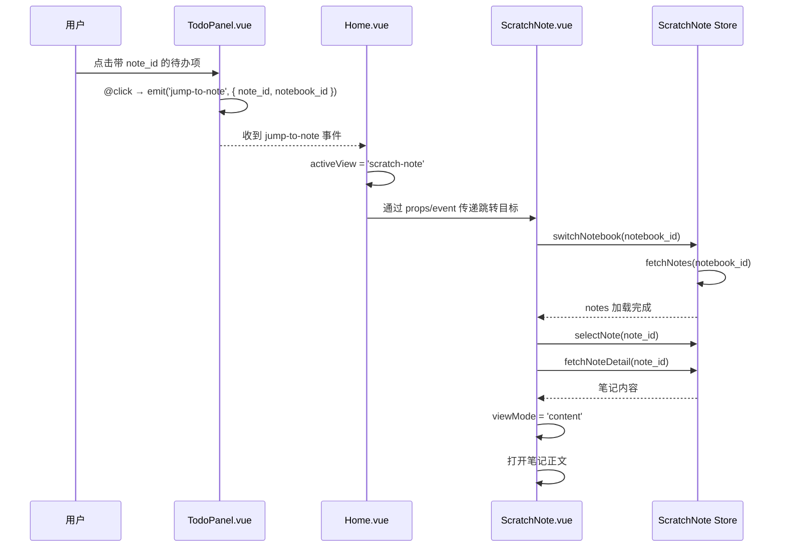
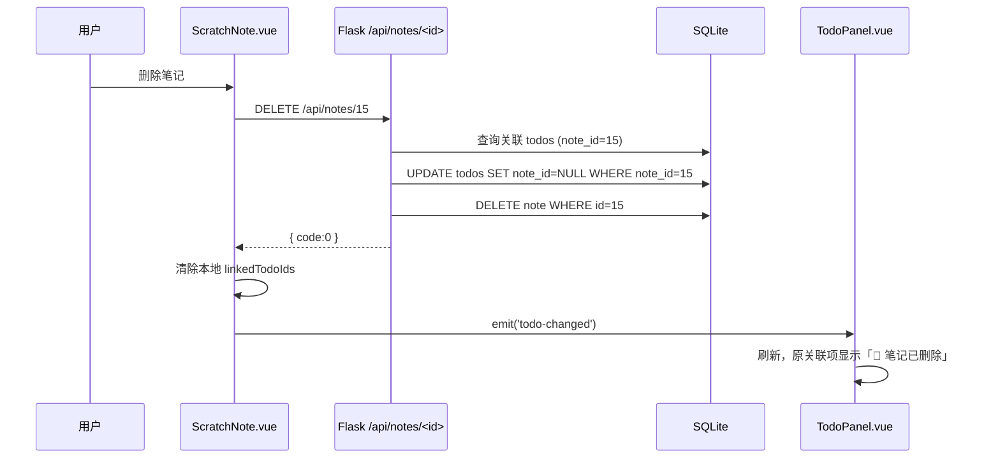
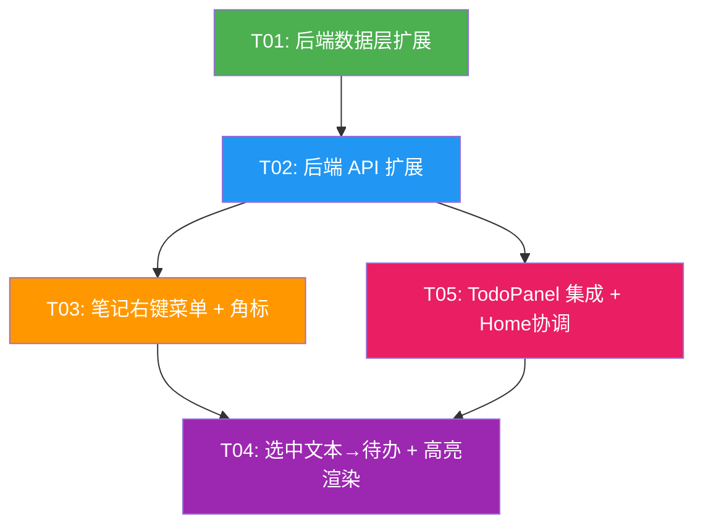

# 系统设计：摸鱼笔记 ↔ 待办栏双向联动

> 架构师：高见远  
> 项目：轻鸿主页（Python Flask + Vue 3 + Pinia + SQLite + Vite）

---

## Part A：系统设计

### 1. 实现方案

#### 核心难点分析

| 难点 | 说明 | 解决方案 |
|------|------|----------|
| **文本选中 → 待办** | textarea 不支持富文本高亮，无法直接在 textarea 内显示颜色下划线 | 采用**双模渲染**：编辑用 textarea，有高亮的笔记启用 **contenteditable div** 预览模式，高亮文本用 `<u>` 包裹，保存时取 `innerText` 保证纯文本存储 |
| **笔记标题右键菜单** | ScratchNote 目前 `sn-note-entry` 只有单击打开笔记，无右键菜单 | 在 `sn-note-entry` 和正文页标题区统一添加 `@contextmenu.prevent` 处理器 |
| **TodoPanel 跳转笔记** | TodoPanel 当前只渲染 todo 列表，无笔记跳转能力 | TodoPanel 中 todo 若包含 `note_id`，显示「📄 跳转」按钮，点击触发自定义事件，Home.vue 接收后切换到 `scratch-note` 视图并打开对应笔记 |
| **同步一致性** | 笔记删除后关联的待办需处理 | Todo 的 `note_id` 设为 nullable FK，笔记删除时 todo 保持存在但 `note_id` 置 NULL（不级联删除，用户可能还想保留待办），前端显示「📄 笔记已删除」 |
| **角标显示** | 笔记标题旁显示待办小角标 | 从 TodoPanel 拉取数据，或新增轻量接口 `GET /api/todos/by-note-batch?note_ids=1,2,3` 批量查询哪些笔记有待办链接 |

#### 框架选型

| 层 | 技术 | 理由 |
|----|------|------|
| 后端 ORM | SQLAlchemy（已有） | 项目已使用，直接扩展 Todo 模型字段 |
| 前端状态 | Pinia（已有） | scratchNote store 已存在，新增 `linkedTodoIds` 状态 |
| 富文本/高亮 | 原生 contenteditable div | 避免引入第三方富文本库，keep it simple |
| 右键菜单 | 原生 `@contextmenu` + Teleport | 项目已有类似模式（TodoPanel 右键菜单） |

#### 架构模式

```
用户交互层                   更新/查询层                   存储层
┌─────────────┐         ┌──────────────┐          ┌─────────────┐
│ ScratchNote  │────右键──▶│  ContextMenu  │──创建──▶│  Todo Model  │
│  (笔记视图)   │         │  (统一右键)    │          │ (扩展字段)    │
└─────────────┘         └──────────────┘          └─────────────┘
       │                       │                        ▲
       │ selection             │                        │
       ▼                       ▼                        │
┌─────────────┐         ┌──────────────┐               │
│  选中文本    │────────▶│  TodoPanel   │──刷新──────────┘
│ (高亮渲染)   │         │ (待办栏显示  │
└─────────────┘         │  笔记角标)   │
                         └──────────────┘
                               │
                               │ 点击跳转
                               ▼
                         ┌──────────────┐
                         │  Home.vue     │
                         │ (视图协调器)  │
                         └──────────────┘
```

---

### 2. 文件清单

```
# ── 后端（3 修改 + 0 新建） ──
backend/models/todo.py                 # [修改] 添加 note_id, notebook_id, selected_text 字段
backend/routes/todo.py                 # [修改] 扩展端点支持 note 关联查询/创建
backend/routes/scratch_note.py         # [修改] 删除笔记时将关联 todo 的 note_id 置 NULL

# ── 前端 API 层（1 修改 + 0 新建） ──
src/api/todo.js                        # [修改] 新增 by-note 查询接口

# ── 前端 Store（1 修改） ──
src/stores/scratch-note.js             # [修改] 新增 linkedTodoIds 状态 + 高亮数据管理

# ── 前端组件（3 修改） ──
src/components/center/ScratchNote.vue  # [修改] 笔记标题右键菜单 + 文本选中菜单 + 高亮渲染
src/components/todo/TodoPanel.vue      # [修改] 笔记跳转按钮 + selected_text 预览 + 角标
src/views/Home.vue                     # [修改] 接收 todo-jump 事件，切换到笔记视图

# ── 数据库迁移 ──
backend/migrations/versions/xxxx_add_todo_note_link.py  # [新建] Alembic 迁移脚本
```

**合计：4 修改（后端模型/路由）+ 5 修改（前端）+ 1 新建（迁移）= 10 个文件变更**

---

### 3. 数据结构和接口

#### 3.1 Todo 模型扩展



#### 3.2 Todo to_dict 扩展

```python
def to_dict(self):
    result = {
        # ... 原有字段不变 ...
        'note_id': self.note_id,
        'notebook_id': self.notebook_id,
        'selected_text': self.selected_text,
    }
    return result
```

#### 3.3 后端 API 端点

| 方法 | 路径 | 说明 | 变更类型 |
|------|------|------|----------|
| `GET` | `/api/todos?done=&note_id=` | 列表查询，新增 `note_id` 筛选参数（可选） | 修改 |
| `POST` | `/api/todos` | 创建待办，新增可选字段 `note_id, notebook_id, selected_text` | 修改 |
| `PUT` | `/api/todos/<id>` | 更新待办（已支持任意字段） | 无变更 |
| `DELETE` | `/api/todos/<id>` | 删除待办 | 无变更 |
| `GET` | `/api/todos/by-note/<note_id>` | **[新增]** 查询某笔记关联的所有待办 | 新增 |
| `GET` | `/api/todos/by-note-batch?note_ids=1,2,3` | **[新增]** 批量查询哪些笔记有关联待办（返回 map） | 新增 |
| `DELETE` | `/api/notes/<id>` | **[修改]** 删除笔记时将关联 todo 的 note_id 置 NULL | 修改 |

#### 3.4 响应格式（统一）

```json
// POST /api/todos (from-note)
{
  "code": 0,
  "data": {
    "id": 42,
    "title": "完成项目UI重构",
    "done": false,
    "note_id": 15,
    "notebook_id": 3,
    "selected_text": "重构现有UI组件",
    "note_title": "UI重构计划",        // [NEW] 前端组装方便，后端不返回，前端从 store 取
    ...
  },
  "message": "待办创建成功"
}

// GET /api/todos/by-note-batch?note_ids=1,2,3
{
  "code": 0,
  "data": {
    "1": [{"id": 42, "title": "..."}],    // note_id -> todos[]
    "3": [{"id": 45, "title": "..."}]
  }
}
```

---

### 4. 程序调用流程

#### 4.1 笔记标题右键 → 添加待办



#### 4.2 选中文本 → 添加待办



#### 4.3 待办栏点击 → 跳转笔记



#### 4.4 笔记删除 → 关联待办清空



---

### 5. 待明确事项

| # | 事项 | 当前假设 |
|---|------|----------|
| 1 | **高亮渲染方案** | 使用 contenteditable div 替代 textarea 显示高亮。若希望保留纯 textarea，可简化为只在 TodoPanel 显示 selected_text 预览，不实现笔记内高亮。**建议确认** |
| 2 | **浮动菜单样式** | 选中文本后的浮动菜单设计未定。暂定类似 Medium 风格的浮动 tooltip （选中文本 → 上方出现 "+ 待办" 按钮），或其他方案？ |
| 3 | **多选文本高亮** | 同一笔记可多次选中不同文本添加到不同待办。多条高亮共存时颜色如何分配？暂定每个 todo 分配不同下划线颜色（从 TodoPanel 配色池取色） |
| 4 | **角标交互** | 笔记标题旁的 📌 角标点击是否直接跳转到对应待办？暂定只是视觉提示，不交互 |
| 5 | **右键菜单触发范围** | 左侧弹出目录、主目录页的 recent notes、正文页标题区域，三处都需加右键菜单。移动端是否也支持？暂定仅桌面端 |

---

## Part B：任务分解

### 6. 所需依赖包

无新增依赖。项目已有：
```
- flask, flask-jwt-extended, sqlalchemy（后端）
- vue@3, pinia, vite（前端）
- sortablejs（前端拖拽，已有）
```

### 7. 任务列表

| 任务 ID | 任务名称 | 源文件 | 前置依赖 | 优先级 |
|---------|----------|--------|----------|--------|
| **T01** | **后端数据层扩展** — Todo 模型增加 note 关联字段 + 迁移 + 删除笔记时置 NULL | `backend/models/todo.py`, `backend/routes/scratch_note.py`, `backend/migrations/...py` | — | P0 |
| **T02** | **后端 API 扩展** — 新增 by-note 查询端点 + 扩展 POST 支持 note 字段 | `backend/routes/todo.py`, `src/api/todo.js` | T01 | P0 |
| **T03** | **笔记右键菜单** — 笔记标题右键「添加到待办/从待办删除」+ 角标 + store 扩展 | `src/stores/scratch-note.js`, `src/components/center/ScratchNote.vue`, `src/api/todo.js` | T02 | P0 |
| **T04** | **选中文本 → 待办** — 文本选中浮层 + 高亮渲染（contenteditable 模式） | `src/components/center/ScratchNote.vue`, `src/components/todo/TodoPanel.vue` | T03 | P1 |
| **T05** | **TodoPanel 集成** — 笔记跳转按钮 + selected_text 预览 + 笔记已删除提示 + Home.vue 协调 | `src/components/todo/TodoPanel.vue`, `src/views/Home.vue`, `src/stores/scratch-note.js` | T02, T03 | P0 |

#### 任务详情

##### T01：后端数据层扩展

- **文件**：`backend/models/todo.py` + `backend/routes/scratch_note.py` + 新建迁移脚本
- **内容**：
  - `Todo` 模型新增：`note_id` (Integer, FK→notes.id, nullable)、`notebook_id` (Integer, FK→notebooks.id, nullable)、`selected_text` (Text, nullable)
  - `to_dict()` 增加这三个字段
  - `delete_note` 路由中，删除笔记前先执行 `Todo.query.filter_by(note_id=note_id).update({'note_id': None})`
  - 提供 Alembic 迁移脚本 / 纯 SQL `ALTER TABLE` 语句

##### T02：后端 API 扩展

- **文件**：`backend/routes/todo.py` + `src/api/todo.js`
- **内容**：
  - 扩展 `POST /api/todos`：接受可选字段 `note_id, notebook_id, selected_text`
  - 新增 `GET /api/todos/by-note/<note_id>`：返回该 note 关联的所有 todos
  - 新增 `GET /api/todos/by-note-batch?note_ids=1,2,3`：批量查询，返回 `{note_id: [todo, ...]}` 的 map
  - `src/api/todo.js` 新增：`getTodosByNote(noteId)`, `getTodosByNoteBatch(noteIds)`

##### T03：笔记右键菜单 + 角标

- **文件**：`src/stores/scratch-note.js` + `src/components/center/ScratchNote.vue`
- **内容**：
  - `scratch-note store` 新增：`linkedTodoIds` (Set)，`fetchLinkedTodos()` 方法调用 `by-note-batch` API
  - `ScratchNote.vue` 的 `.sn-note-entry` 和 `.sn-recent-item` 添加 `@contextmenu`：
    - 菜单项：`📌 添加到待办` / `❌ 从待办删除`
  - 正文页标题区（`.sn-header` 内）添加同样的右键菜单
  - 笔记标题旁根据 `linkedTodoIds` 显示角标 `📌`
  - 标题右键菜单触发时：若 note_id 不在 linkedTodoIds 中 → 调用 `createTodo`；存在 → 调用 `deleteTodo`

##### T04：选中文本 → 待办 + 高亮渲染

- **文件**：`src/components/center/ScratchNote.vue`（主要修改）
- **内容**：
  - 在 `sn-textarea` 区监听 `mouseup`，检测是否有选中文本
  - 有选中文本时出现浮动 tooltip「📌 添加到待办」
  - 点击后创建 todo 并传入 `selected_text`
  - 笔记正文启用 contenteditable div 预览模式（替代 textarea 模式）：
    - 有 `selected_text` 高亮的笔记，显示「预览/编辑」切换按钮
    - 预览模式：用 div 渲染内容，`selected_text` 用 `<u>` 包裹并着色
    - 编辑模式：切换回 textarea（高亮临时隐藏）
  - 保存时通过 `div.innerText` 获取纯文本，避免 HTML 污染

##### T05：TodoPanel 集成 + Home.vue 协调

- **文件**：`src/components/todo/TodoPanel.vue` + `src/views/Home.vue`
- **内容**：
  - `TodoPanel` 中 todo 项若有 `note_id`，显示：
    - 📄 图标（可点击跳转）
    - 若含 `selected_text`，在 title 下方显示预览文本（灰色小字，截断 60 字）
    - 若 note 已删除（`note_id` 为 NULL 但原有过），显示「📄 笔记已删除」灰色文字
  - 点击 📄 图标 → `emit('jump-to-note', { note_id, notebook_id })`
  - `Home.vue` 监听 `jump-to-note` 事件：
    - 切换 `activeView = 'scratch-note'`
    - 通知 ScratchNote 跳转到指定 note

---

### 8. 共享知识

```
1. 响应格式：后端所有响应统一 { code, data?, message }
2. 认证方式：JWT，通过 get_jwt_identity() 获取 user_id
3. ScratchNote 视图片段：Home.vue 通过 activeView === 'scratch-note' 切换
4. TodoPanel 刷新：监听 refreshKey prop 变化 + todo-changed 事件
5. note_id 约定：
   - 创建 todo 时传入 note_id → 表示该 todo 源自此笔记
   - 笔记删除时 note_id 置 NULL（不删除 todo）
   - 前端判断：todo.note_id !== null → 可跳转
6. 高亮存储：selected_text 存纯文本片段，渲染时在 contenteditable div 中用 <u> 包裹
7. 文本选中：使用 window.getSelection().toString() 获取，保存时 trim 去首尾空格
8. 右键菜单统一放入 <Teleport to="body"> 避免 z-index 问题
```

---

### 9. 任务依赖图



---

### 附录：关键代码片段

#### Todo 模型扩展（修改点）

```python
# backend/models/todo.py — 在现有字段后追加
class Todo(db.Model):
    # ... 现有字段 ...
    
    # ── 笔记关联（摸鱼笔记 ↔ 待办双向联动） ──
    note_id = db.Column(db.Integer, db.ForeignKey('notes.id', ondelete='SET NULL'), 
                        nullable=True, index=True)
    notebook_id = db.Column(db.Integer, db.ForeignKey('notebooks.id', ondelete='SET NULL'),
                            nullable=True)
    selected_text = db.Column(db.Text, nullable=True)

    def to_dict(self):
        result = { ... existing fields ... }
        # 新增字段
        result['note_id'] = self.note_id
        result['notebook_id'] = self.notebook_id
        result['selected_text'] = self.selected_text
        return result
```

#### 删除笔记时清空关联（修改点）

```python
# backend/routes/scratch_note.py — 在 delete_note 函数中
@scratch_note_bp.route('/notes/<int:note_id>', methods=['DELETE'])
@jwt_required()
def delete_note(note_id):
    user_id = int(get_jwt_identity())
    note = Note.query.filter_by(id=note_id, user_id=user_id).first()
    if not note:
        return error('笔记不存在', 404)
    
    # 清空关联的 todo 的 note_id
    Todo.query.filter_by(note_id=note_id, user_id=user_id).update(
        {'note_id': None}
    )
    
    db.session.delete(note)
    # ... 更新 notebook updated_at ...
    db.session.commit()
    return success(message='笔记已删除')
```

#### 前端创建 note-todo（参考）

```javascript
// ScratchNote.vue - 添加待办
async function addNoteToTodo(note) {
  const res = await createTodo(
    note.title,
    0, null,
    { note_id: note.id, notebook_id: store.currentNotebookId }
  );
  linkedTodoIds.value.add(note.id);
  emit('todo-changed');
}

// 选中文本添加待办
async function addSelectionToTodo(selectedText, note) {
  const res = await createTodo(
    note.title,
    0, null,
    { 
      note_id: note.id, 
      notebook_id: store.currentNotebookId,
      selected_text: selectedText 
    }
  );
  linkedTodoIds.value.add(note.id);
  emit('todo-changed');
}
```
